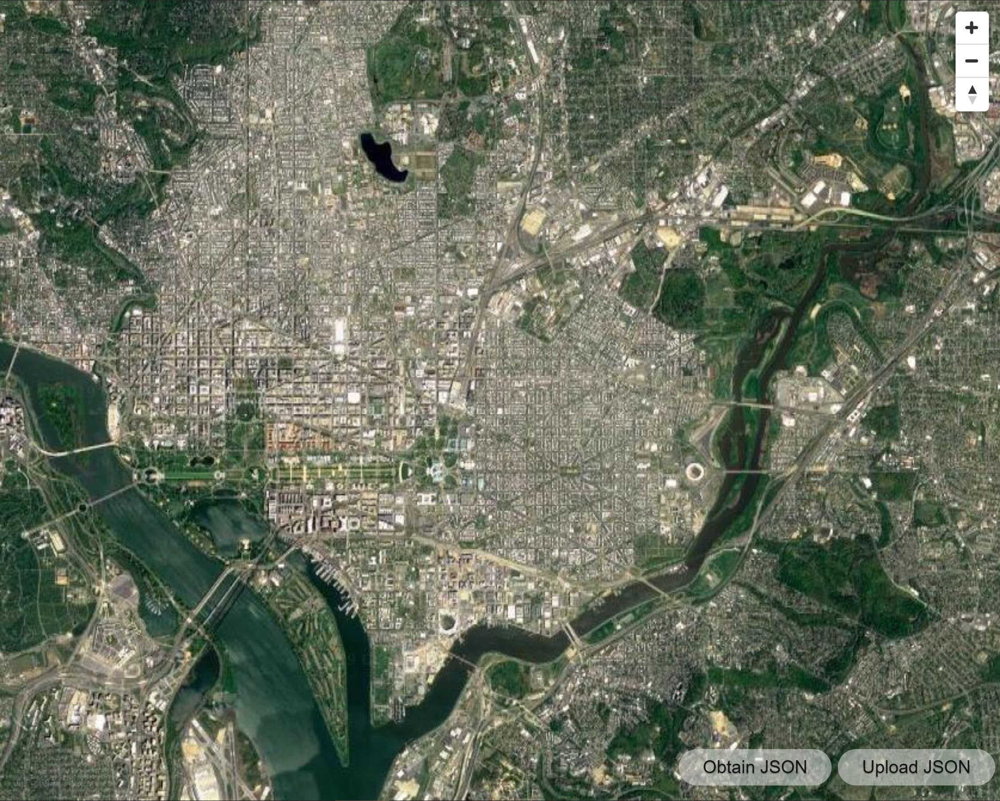

# CS6221 Project
## Geo Location Data Vis

## Dependencies
[Echarts](https://echarts.apache.org/en/index.html) for statistics and data visualization  
[MapboxGL EchartsLayer](https://github.com/lzxue/echartsLayer) and [MapboxGLJS](https://docs.mapbox.com/mapbox-gl-js/api/) for loading and displaying the map  
[Oboes.js](http://oboejs.com/) for loading JSON file  
[Mapbox Styles](https://docs.mapbox.com/api/maps/#styles)

## Introduction
This is a data visualization project, the user can explore their own geographical location history by uploading the data file collected by google. Users can explore their own data by selecting a specific period of time.
The purpose of this project is to make people aware of data collection behavior. And we also want to give everyone the capability to view the history of themselves.

## Algorithm
We want the image to focus on the most active location at the beginning of the exploration. Calculating the centroid of a convex hull could be a practical solution to get the most active area. Some references are shown below.  
[reference](https://www.gamedev.net/forums/topic/533590-how-to-find-the-center-point-of-a-convex-hull/)

## Method
The programming language we choose is **JavaScript**. Because there are many tools and libraries to help us focus on the development of the core logic. And the flexibility of this language is suitable for [Agile Development](https://en.wikipedia.org/wiki/Agile_software_development).  
The process of our scrum developemt could be like this:

| STAGE | TASK |
|  :-:  |  :-: |
| 1 | Display map on web browser Read data from JSON file and extract location data |
| 2 | Draw loaction layer on top of map layer |
| 3 | Display location data in specific period of time selected by user  Classify data by activities  Draw statistics of user activites |
| 4 | Add social media sharing intergration |

## Results and Findings
We discovered that the data comes with all kinds of possible activities at each location. Each possible activity has a confidence value, so we can decide what the user was doing base on the confidence value.  
